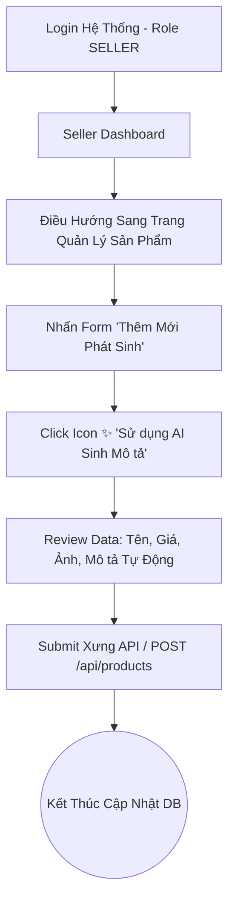

# 3. User Flows & Thiết kế Wireframe

Tài liệu này định nghĩa luồng người dùng (User Flows) nhằm đảm bảo nhóm phát triển hiểu rõ hệ thống hoạt động như thế nào trải dài qua các luồng khác nhau trước khi tiến hành code, và đưa ra danh sách các thiết kế Wireframe (Figma) bắt buộc, không làm sơ sài.

---

## 3.1 Biểu Đồ Luồng (User Flows)

### Flow 1: Trải nghiệm Mua Hàng & Tương Tác AI (Buyer Flow)

```mermaid
flowchart TD
    A[Truy cập SShopBot] --> B{Đã Đăng Nhập chưa?}
    B -- Rồi --> C[Trang Chủ (Home) / Browse Products]
    B -- Chưa --> D[Trang Log in]
    D --> E{Log in thành công?}
    E -- Không --> D
    E -- Có --> C
    
    C --> F[Tìm Kiếm / Lọc Sản phẩm / Range Giá]
    C --> G[Mở Cửa Sổ AI Chatbot Góc Màn Hình]
    G --> H[Typing: 'Gợi ý Laptop văn phòng 15 triệu']
    H --> I[AI Processing - Tìm DB & Trả kết quả]
    I --> J[Hành động Thêm Vào Giỏ hàng]
    F --> J
    
    J --> K[Chuyển tới Trang Checkout]
    K --> L{Xác thực và Thanh Toán}
    L -- Success --> M[Trừ Kho, Tạo Đơn, Gửi Email]
    L -- Failed --> N[Báo lỗi Alert, Hủy Transaction]
    
    M --> O((User Flow Kết Thúc Hệ Thống))
```

### Flow 2: Luồng Quản Lý Sản Phẩm (Seller Flow)



---

## 3.2 Kế Hoạch Layout Wireframes Rõ Ràng

Dự án bắt buộc phải có màn hình thiết kế Low-fidelity/High-fidelity trên Figma với tối thiểu 4 màn hình sau, đáp ứng đủ các luồng trên:

### 1. Màn hình Đăng Nhập/Đăng Ký (Login)
*   **Thành phần UX:**
    *   Form Input cho Email và Password, hỗ trợ Label nằm rõ ràng.
    *   Tooltip/Feedback Notification màu đỏ nằm hiển thị dưới Input nếu sai mật khẩu thay vì nhảy Layout (Avoid Layout Shift).

### 2. Màn hình Danh Sách Giao Diện (Product List)
*   **Thành phần UX:**
    *   **Sidebar Trái (Filter):** Có thanh trượt (Slider) để lọc giá từ Min -> Max; Checkbox Categories.
    *   **Khu vực trung tâm (Grid):** Card Sản Phẩm bao gồm Hình, Giá màu đỏ, Tên (Trang trí max 2 lines và dùng ellipsis), Icon Cart.

### 3. Màn hình Form Thêm Sản Phẩm (Form Entity)
*   **Thành phần UX:**
    *   Chủng loại Area: Các ô input phải hỗ trợ trạng thái *Active* và *Error State*.
    *   Button: `Dùng Trí Tuệ Nhân Tạo để viết Mô tả` là tính năng Hero của Project → Nút cần làm nổi bật (Màu Gradient).

### 4. Màn hình Thống Kê Điều Khiển (Dashboard Admin/Seller)
*   **Thành phần UX:**
    *   3 Thẻ Top Cards dùng để thống kê số liệu siêu nhanh: Revenue, Total Orders, Out of Stock Items.
    *   Biểu đồ Column Chart bự giữa màn hình nằm dưới để theo dõi lượng Sale mỗi Tuần.
    *   Bên trái là bảng Table Data cho Recent Transactions.
