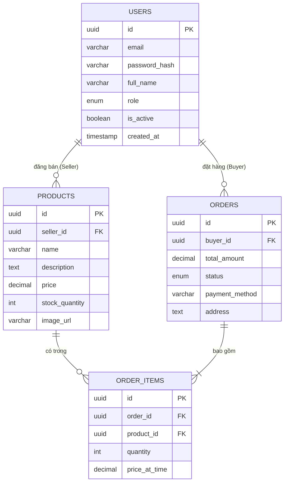

# 5. Data Dictionary (Từ điển Dữ liệu) & Traceability Matrix (Ma trận Truy vết)

Tài liệu này bao gồm định nghĩa chi tiết về cơ sở dữ liệu để đảm bảo tính nhất quán (Data Dictionary), và Ma trận Truy vết (Traceability Matrix) giúp đội ngũ phát triển (và Giảng Viên) chứng minh được rằng mọi Yêu cầu liệt kê ra lúc đầu đều được thiết kế, lập trình và đưa vào kiểm thử một cách đầy đủ khép kín.

---

## 5.1 Sơ Đồ Thực Thể - Mối Quan Hệ (ERD) & Từ điển Dữ liệu

Sơ đồ ERD (Entity Relationship Diagram) dưới đây mô phỏng mối quan hệ cốt lõi giữa các bảng dữ liệu: `USERS`, `PRODUCTS`, `ORDERS` và `ORDER_ITEMS`.

### Từ điển Dữ liệu chi tiết

Bảng phân tích mức logic (Logical Data Model) cho những Entity quan trọng nhất:

### Bảng 1: `Users` (Người dùng)
Lưu thông tin đăng nhập hệ thống và hồ sơ người dùng.

| Tên Cột | Kiểu Dữ liệu | Khóa | Not Null | Mô tả logic kinh doanh |
| :--- | :--- | :---: | :---: | :--- |
| `id` | UUID | PK | Yes | Khóa chính tự sinh (Auto-generated UUIDv4) |
| `email` | VARCHAR(255) | UQ | Yes | Địa chỉ email dùng để định danh đăng nhập |
| `password_hash` | VARCHAR(255) | - | Yes | Chuỗi Mật khẩu đã băm (Bcrypt) không giải mã |
| `full_name` | VARCHAR(100) | - | Yes | Tên hiển thị người dùng / Tên Shop |
| `role` | ENUM | - | Yes | Thuộc tập `{ADMIN, SELLER, BUYER}` |
| `is_active` | BOOLEAN | - | Yes | Mặc định `true`. Set `false` nếu ban Acc |
| `created_at` | TIMESTAMPTZ | - | Yes | Thời gian tạo tài khoản |

### Bảng 2: `Products` (Sản phẩm)
Lưu trữ thông tin hàng hóa đăng từ Seller để bán.

| Tên Cột | Kiểu Dữ liệu | Khóa | Not Null | Mô tả logic kinh doanh |
| :--- | :--- | :---: | :---: | :--- |
| `id` | UUID | PK | Yes | Khóa chính tự sinh |
| `seller_id` | UUID | FK | Yes | Tham chiếu Bảng `Users` (Chỉ role SELLER) |
| `name` | VARCHAR(255) | - | Yes | Tên chi tiết của sản phẩm |
| `description` | TEXT | - | No | Đoạn mô tả (Có hỗ trợ AI Generator điền vào) |
| `price` | DECIMAL(12,2) | - | Yes | Giá bán (Đơn vị nội địa VNĐ) > 0 |
| `stock_quantity`| INT | - | Yes | Số lượng tồn kho thực tế >= 0. Trừ dần khi Checkout |
| `image_url` | VARCHAR(500) | - | No | Chuỗi phân tách dẫn link lưu hình ảnh (S3, CDN) |

### Bảng 3: `Orders` (Đơn hàng)
Lưu trữ lịch sử và trạng thái quy trình Transaction giao dịch.

| Tên Cột | Kiểu Dữ liệu | Khóa | Not Null | Mô tả logic kinh doanh |
| :--- | :--- | :---: | :---: | :--- |
| `id` | UUID | PK | Yes | Khóa chính tự sinh dùng làm Mã Vận Đơn |
| `buyer_id` | UUID | FK | Yes | Tham chiếu đến người mua thuộc bảng `Users` |
| `total_amount` | DECIMAL(12,2) | - | Yes | Tổng tiền cuối cùng bắt buộc phải thanh toán |
| `status` | ENUM | - | Yes | Tập `{PENDING, PAID, SHIPPED, CANCELED}` |
| `payment_method`| VARCHAR(50)| - | Yes | Dấu hiệu nhận biết luồng `COD` hay `GATEWAY` |
| `address` | TEXT | - | Yes | Địa chỉ Text Box giao hàng đầy đủ |

---

## 5.2 Ma trận Truy vết (Traceability Matrix)

Ma trận dưới đây chứng minh Dự án SShopBot duy trì quá trình kiểm tra chéo (Validation Requirement): Dấu hiệu cho thấy không có một Chức năng nào bị rớt vào khoảng trống mà không có Layout Design hay đoạn Code tương đương:

| ID Yêu cầu | Tên Yêu cầu Hệ thống | Thiết kế ánh xạ (Design/Wireframe) | Function/Lớp xử lý Code (Implementation) | ID Kiểm thử (Test Case ID) | Trạng thái Mapping |
| :---: | :--- | :--- | :--- | :---: | :---: |
| **FR1** | Đăng Nhập Hệ Thống | 1. Màn hình Login UI | REST `POST /api/auth/login` | TC_AUTH_01, TC_AUTH_02 | ✅ Đã Cover |
| **FR2** | Đăng Mặt hàng (Seller) | 3. Màn hình Form Thêm Sản Phẩm | REST `POST /api/products` | TC_PROD_01 | ✅ Đã Cover |
| **FR3** | Bộ Lọc Tìm Kiếm & Lọc | 2. Màn hình Mua Sắm Danh Sách | Logic Filter Middleware Prisma | TC_FLT_01, TC_FLT_02 | ✅ Đã Cover |
| **FR4** | AI Chatbot Tư Vấn | Floating Widget Popup Component | `WS /chat/stream` & Gateway LLM | TC_CHAT_01, TC_CHAT_02 | ✅ Đã Cover |
| **FR5** | Thanh Toán (Deduct kho)| Màn hình xác thực & Toast Alert| REST `POST /api/orders/checkout`| TC_ORD_01, TC_ORD_02 | ✅ Đã Cover |

**Kết luận validation:** Tổng kết ma trận (Forward Traceability) chỉ ra rằng tất cả Functional Requirements (Từ FR1 > FR5) đều đã trải qua khâu định nghĩa thiết kế UI (Design Layout), thiết kế Backend API/Schema (Implementation) và có ID chuẩn bị cho việc Tester viết Script kiểm thử. Không có yêu cầu nào dư thừa, chống chéo hoặc mâu thuẫn lẫn nhau!
