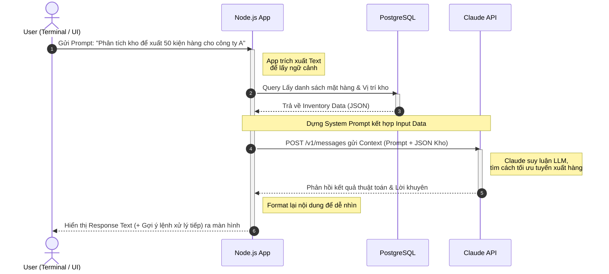

# 6. Tích hợp AI & Thiết kế Hệ thống Thông minh (Smart Warehouse)

Tài liệu này trình bày các sơ đồ biểu diễn kiến trúc và luồng hoạt động khi tích hợp Trí tuệ Nhân tạo (ở đây sử dụng API của LLM, ví dụ như Claude / Anthropic) vào dự án. Việc ứng dụng AI sẽ lập tức biến dự án Warehouse Simulation kết hợp E-Commerce thông thường trở thành một **Hệ Thống Kho Thông Minh (Smart Warehouse)**.

---

## 6.1 Sơ Đồ Kiến Trúc (Architecture Diagram)

Sơ đồ mô tả vị trí của Claude AI trong hệ thống. Việc người dùng gọi lệnh sẽ luôn đi qua Backend để đảm bảo bảo mật Private Key, cũng như cho phép Backend "nhồi" thêm dữ liệu nội bộ dể hệ AI có thể đưa ra câu trả lời chính xác nhất.

```mermaid
flowchart TD
    %% Định dạng style màu sắc
    classDef user fill:#64B5F6,stroke:#1E88E5,stroke-width:2px,color:#fff
    classDef client fill:#81C784,stroke:#4CAF50,stroke-width:2px,color:#fff
    classDef backend fill:#FFB74D,stroke:#F57C00,stroke-width:2px,color:#fff
    classDef db fill:#9575CD,stroke:#673AB7,stroke-width:2px,color:#fff
    classDef ai fill:#F06292,stroke:#E91E63,stroke-width:3px,color:#fff

    User((Người dùng\nAdmin / Buyers)):::user
    
    subgraph Client Layer
        Terminal[Vs Code Terminal\n(Môi trường Simulation)]:::client
        WebUI[Web UI React.js\n(Môi trường Thực tế)]:::client
    end
    
    subgraph Backend Core Layer
        API[Node.js / NestJS App\nController & Logic]:::backend
    end
    
    subgraph Data & AI Layer
        DB[(PostgreSQL\nWarehouse DB)]:::db
        ClaudeAI{{Claude API\n(AnthropicLLM)}}:::ai
    end

    User <--> Terminal
    User <--> WebUI
    
    Terminal <-->|Lệnh CLI/Text| API
    WebUI <-->|HTTP/REST| API
    
    API <-->|Truy vấn Tồn kho / SQL| DB
    API <-->|Gửi Prompt + Data\nNhận Result (JSON/Text)| ClaudeAI
```

👉 **Giải thích để ghi vào báo cáo:**
Sơ đồ chỉ ra hệ thống Backend (Node.js) đóng vai trò trung gian "điều phối". Thay vì gọi trực tiếp AI, khi User gửi yêu cầu từ Terminal, Node.js sẽ truy vấn thêm Database xem số lượng tồn kho bao nhiêu, ghép kho đó vào Prompt như 1 đoạn Context, rồi mới gọi Claude API.

---

## 6.2 Sơ Đồ Luồng Hoạt Động (Sequence Diagram)

Mô phỏng 1 luồng hệ thống chi tiết kể từ lúc Người Quản Trị (qua Terminal) gửi 1 lệnh thao tác phức tạp cho AI xử lý.



---

## 6.3 Sơ Đồ Tính Năng AI (Smart Use Case Diagram)

Bản đồ này trình diễn các Use Cases chỉ khả thi khi có AI "nhúng" vào, đóng vai trò nâng cấp hệ thống kho hàng và cửa hàng lên mức độ Tự Động Hóa.

```mermaid
usecaseDiagram
    actor Admin as "Quản trị viên Kho\n(Admin Terminal)"
    actor User as "Nhân viên / Khách hàng\n(Web/App)"
    
    package "Smart Warehouse Engine (NLP AI)" {
        usecase "Hỏi AI để tạo lập đơn hàng từ văn bản ngẫu nhiên" as UC1
        usecase "Tự động phân tích & Tối ưu vị trí kho hàng" as UC2
        usecase "Hỏi AI báo cáo số liệu & Dự đoán cạn kho" as UC3
        usecase "AI hỗ trợ viết Mô tả Sản Phẩm chuẩn SEO" as UC4
    }

    Admin --> UC2
    Admin --> UC3
    
    User --> UC1
    User --> UC4
    
    note "Quy trình sử dụng Mô hình\nClaude/Anthropic để\nnhận diện Function Calling" as N1
    UC1 .. N1
    UC2 .. N1
```

👉 **Giá trị gia tăng ấn tượng cho dự án (Điểm cộng):**
1.  **AI hỗ trợ tìm và tối ưu kho (UC2):** Sắp xếp hàng theo Date (FIFO), theo khối lượng, tính toán khu vực lưu kho hợp lý nhất qua phân tích của AI.
2.  **Hỏi AI để tạo / nhập kho (UC1):** Thay vì click chuột thủ công từng thẻ mặt hàng. User chỉ cần gõ trên Terminal: *"Ngày mai nhập 20 thùng táo vào kho miền Nam, có mã KH02"*, AI sẽ parse ra API để tạo lệnh nhập kho tự động.
3.  **Dự đoán hàng (UC3):** AI đánh giá tốc độ tiêu thụ hiện tại và cảnh báo tự động lên màn hình những mã sắp hết.
