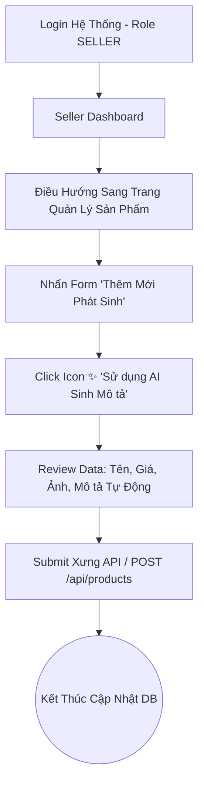
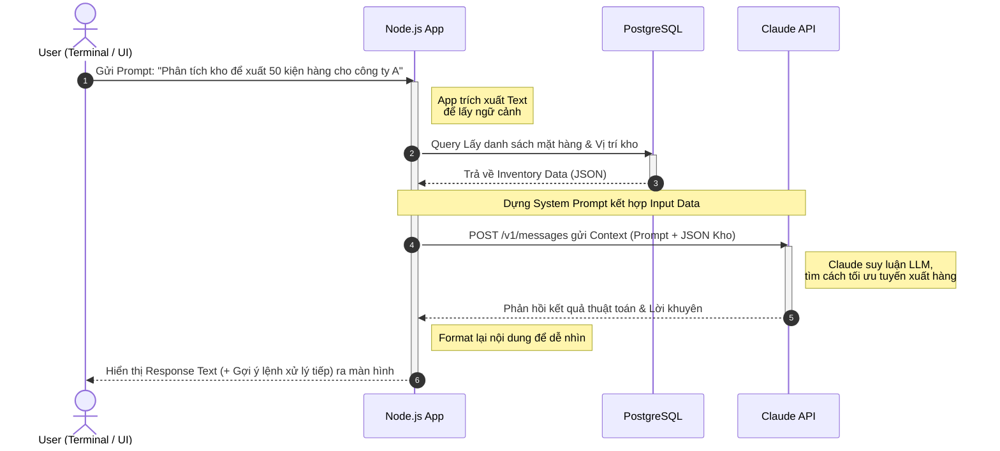

# SShopBot
**AI-Powered E-Commerce Platform**
**Tài liệu Tóm tắt Ý tưởng & Thiết kế Hệ thống**

| Thuộc tính | Chi tiết |
|---|---|
| **Phiên bản** | v1.0 — Bản thảo |
| **Ngày tạo** | Tháng 3, 2026 |
| **Loại phần mềm** | Web App + Chatbot AI |
| **Tech Stack** | NestJS + PostgreSQL + React |
| **Đối tượng** | Cộng đồng / Nhiều nhóm người dùng (Người mua, Người bán, Quản trị viên) |

***

## 1. Giới thiệu Dự án
SShopBot hướng tới việc xây dựng nền tảng thương mại điện tử kết hợp sức mạnh của Trí tuệ Nhân tạo (AI). Nền tảng này không chỉ cung cấp những tính năng quen thuộc của một sàn TMĐT mà còn trang bị "Trợ lý AI" thông minh để hỗ trợ toàn diện các nhóm người dùng trên hệ thống. 

## 2. Mục tiêu Dự án
- **Tự động hóa quá trình chăm sóc khách hàng:** Cho phép chatbot làm việc 24/7.
- **Tăng trải nghiệm mua sắm:** Trợ lý AI có thể tư vấn sản phẩm dựa trên nhu cầu thực tế, phân tích ngân sách và thu thập sở thích của từng nhóm người dùng.
- **Hỗ trợ người bán:** Dự đoán xu hướng mua sắm hoặc hỗ trợ quản lý kho, tự động tạo ra mô tả thu hút cho các sản phẩm.

## 3. Các tính năng chính (Core Features)

### 3.1 Giao diện cho Người mua (Buyers)
- **Quản lý tài khoản**: Đăng ký, Đăng nhập (JWT/OAuth2), Profile, Lịch sử mua hàng.
- **Tìm kiếm & Trải nghiệm Mua sắm**: Lọc sản phẩm nâng cao.
- **Giỏ hàng & Thanh toán (Cart & Checkout)**.
- **AI Chatbot Tư vấn**: 
  - Chat trực tiếp với bot để hỏi chi tiết về sản phẩm.
  - Hỗ trợ giải đáp chính sách giao hàng, hoàn trả.
  - Gợi ý sản phẩm liên quan theo thói quen và nhu cầu.

### 3.2 Giao diện cho Người bán (Sellers / Vendors)
- **Dashboard Quản lý**: Giao diện thống kê đơn hàng, doanh thu (Charts/Graphs).
- **Quản lý sản phẩm**: Thêm, sửa, xóa sản phẩm, giá cả, và thiết lập số lượng kho ngầm.
- **Công cụ AI cho Vendor**: AI giúp tự động tạo mô tả sản phẩm tối ưu SEO, hoặc gợi ý giá bán để cạnh tranh.

### 3.3 Giao diện cho Quản trị viên (Admins)
- **Quản lý Users**: Phân quyền, duyệt quyền người bán, khóa tài khoản vi phạm.
- **System Monitoring**: Giám sát log giao dịch, theo dõi hiệu suất và phản hồi của AI Chatbot.

## 4. Kiến trúc Hệ thống (Architecture)

### 4.1 Backend (NestJS + TypeScript)
- Cung cấp dữ liệu tĩnh và động qua API (RESTful).
- **Cấu trúc Modules dự kiến**:
  - `AuthModule`: Hệ thống xác thực bằng JWT (Passport).
  - `UsersModule`: API cho profile và quản lý tài khoản.
  - `ProductsModule`: API cho danh mục, chi tiết sản phẩm.
  - `OrdersModule`: Quản lý booking, giỏ hàng, và hóa đơn thanh toán.
  - `ChatbotModule`: Cầu nối với model LLM (như OpenAI API, Ollama hoặc Google Gemini) và quản lý session trò chuyện.

### 4.2 Database (PostgreSQL)
- Sử dụng **TypeORM** (hoặc Prisma) cho NestJS Backend.
- Sơ đồ bảng (Tables) cơ bản:
  - `User`, `Role`
  - `Product`, `Category`
  - `Order`, `OrderItem`
  - `ChatSession`, `ChatMessage`

### 4.3 Frontend (React + Vite + TypeScript)
- Chạy nhanh gọn và hiện đại dựa trên Vite.
- Thư viện UI/CSS: TailwindCSS và linh kiện giao diện tự dựng.
- Quản lý State: Redux Toolkit hoặc Zustand.
- Quản lý API Call: React Query / Axios.

***
_Tài liệu đang trong quá trình phát triển và hoàn thiện. Vui lòng đóng góp và chỉnh sửa để hoàn bị các modules tính năng._


# THU THẬP & PHÂN TÍCH YÊU CẦU PHẦN MỀM (Requirement Gathering & Analysis)
**Tên dự án:** Nâng cấp Hệ thống Warehouse Simulation (Tích hợp Trí tuệ Nhân tạo - Smart Warehouse)

Tài liệu này trình bày quy trình chuẩn mực của bộ môn Kỹ thuật Phần mềm (Software Engineering) trong việc Thu thập Yêu cầu (Requirements Elicitation) và Phân tích Yêu cầu (Requirements Analysis). Mục tiêu là tìm ra các "Pain points" (Nỗi đau/Vấn đề) thực tế của hệ thống cũ và đưa ra quyết định nâng cấp tính năng chính xác.

***

## 1. Phương Pháp Thu Thập Yêu Cầu (Elicitation Techniques)

Để đảm bảo các chức năng nâng cấp thực sự giải quyết được bài toán quản lý kho, nhóm thực hiện đã áp dụng các phương pháp quy chuẩn sau đối với những bên liên quan (Stakeholders):

1. **Phỏng vấn trực tiếp (Interviews) với Quản lý kho & Nhân viên thao tác:**
   *   *Phát hiện:* Nhân viên kho tốn nhiều thời gian học thuộc các dòng lệnh Terminal cũ hoặc phải click qua nhiều Form UI phức tạp chỉ để xuất/nhập 1 đơn vị hàng.
   *   *Phát hiện:* Quản lý kho gặp khó khăn trong việc dự đoán số lượng hàng sắp cạn kiệt vì hệ thống chỉ báo khi bằng 0.

2. **Quan sát quy trình hiện tại (Observation / Shadowing):**
   *   *Theo dõi thực tế:* Thời gian trung bình để tìm kiếm thủ công một mặt hàng trong kho có 1000+ sản phẩm mất từ 3-5 phút do sắp xếp hàng chưa có quy luật tối ưu.

3. **Phân tích tài liệu & Biểu mẫu cũ (Document Analysis):**
   *   Xem xét các phiếu nhập/xuất kho cũ, sổ sách Excel... từ đó cấu trúc lại thành mô hình CSDL quy chuẩn (Data Dictionary).

***

## 2. Phân Tích Bài Toán: Cũ (As-Is) vs. Đề Xuất (To-Be)

Dựa trên dữ liệu thu thập, giai đoạn Phân tích khoảng cách (Gap Analysis) được lập ra nhằm khẳng định giá trị của bản Nâng cấp lần này. Dưới đây là sơ đồ so sánh quy trình làm việc (BPMN/Activity Flow) trước và sau khi có AI:

### Sơ đồ Quy trình: Hệ thống Hiện tại (As-Is) vs Hệ thống Tương lai (To-Be)
```mermaid
flowchart TD
    subgraph Quy trình Warehouse As-Is (Thủ công)
        A1[Nhân viên nhận yêu cầu Xuất/Nhập] --> B1[Gõ lệnh Terminal dài / Click qua 4 step UI]
        B1 --> C1{Nhớ sai mã lệnh/vị trí?}
        C1 -- Có --> D1[Tra cứu lại sổ sách/danh sách] --> B1
        C1 -- Không --> E1[Hệ thống ghi nhận vào DB]
        E1 --> F1(Hoàn thành 1 quy trình tốn 5 phút)
    end

    subgraph Quy trình Smart Warehouse To-Be (Có AI)
        A2[Nhân viên gõ/nói yêu cầu tự nhiên] --> B2[AI NLP phân tích Text -> API Command]
        B2 --> C2[AI tự động tối ưu đường đi hàng hóa]
        C2 --> E2[Hệ thống tự động ghi nhận vào DB]
        E2 --> F2(Hoàn thành tốn 10 giây)
    end
    
    %% Style highlights
    style F1 fill:#ffcdd2,stroke:#ef5350,color:#b71c1c
    style F2 fill:#c8e6c9,stroke:#66bb6a,color:#1b5e20
```

| Vấn đề Nghiệp vụ | Hệ thống cũ hiện hành (As-Is) | Giải pháp Nâng cấp (To-Be: Smart Warehouse) |
| :--- | :--- | :--- |
| **1. Thao tác Lệnh / Giao diện** | Gõ cú pháp Terminal cứng ngắc, dễ sai lỗi chính tả / Form nhập liệu rườm rà. | Tích hợp **AI NLP (Claude)**: Gõ lệnh bằng ngôn ngữ tự nhiên: "Mai xuất 10 thùng sữa cho kho 2", AI tự hiểu và mapping ra lệnh tương ứng. |
| **2. Tối ưu Quy hoạch kho** | Các mặt hàng rỗng được xếp thủ công, lung tung, khó đi lại. | Cung cấp thuật toán / AI phân tích các mặt hàng bán chạy ra gần cửa (Smart Placement). |
| **3. Kiểm soát Tồn kho** | Tới khi số lượng = 0 thì mới biết để gọi hàng. | **Phân tích Dự báo (Stock Prediction):** Hệ thống tự động cảnh báo mã hàng nào có tốc độ bán nhanh và gợi ý số lượng cần Restock. |
| **4. Lập Báo cáo & Tra cứu** | Mất thời gian xuất file CSV rồi tự vẽ số liệu bằng tay. | Chatbot Data Analytics: Gõ "Vẽ cho tôi báo cáo nhập kho tuần này", hệ thống tự động sinh biểu đồ ngay trên UI. |

***

## 5. Phân Tích Người Dùng & Bên liên quan (Stakeholder Analysis)

*   **Người sử dụng hệ thống trực tiếp (Warehouse Staff / Terminal User):**
    *   *Mục tiêu:* Tối giản hóa công việc, muốn một công cụ "Hiểu ý mình" thay vì mình phải "Nhớ lệnh". 
    *   *Nhu cầu:* Cần giao diện chat/terminal có AI để tiết kiệm số lần thao tác (Click/Type).
*   **Người Quản lý / Điều hành (Manager / Admin):**
    *   *Mục tiêu:* Giám sát bức tranh toàn cảnh của dòng chảy hàng hóa mà không tốn sức truy vấn DB phức tạp.
    *   *Nhu cầu:* Cần các chỉ số Cảnh báo sớm (Early Warnings) và Báo cáo trực quan siêu nhanh.

***

## 6. Xác Định Giải Pháp Cốt Lõi (Requirements Extraction)

Từ quá trình phân tích nỗi đau hiện trạng của kho hàng, chúng ta chính thức chốt lại các Yêu Cầu Nâng Cấp (Target Requirements) làm nền tảng đưa vào tài liệu Yêu cầu Chức năng (Functional Requirements) và Use Cases như sau:

**A. Core System Extensions (Nâng cấp Cốt lõi):**
*   Yêu cầu cấu trúc hóa Vị trí Kho bãi (Zone, Shelf, Bin) vào CSDL thay vì chỉ lưu số lượng thuần túy.
*   Theo dõi biến động hàng tồn (Audit Logs) Real-time ở mức chi tiết.

**B. Smart Integrations (Tính năng AI Thông Minh mấu chốt):**
*   **Module Natural Language Command:** (Trọng tâm) Chuyển lời thoại văn bản thành API thông qua Claude LLM.
*   **Module Predictive Analytics:** Động cơ cảnh báo hết hàng dựa trên biến động dữ liệu giao dịch 7/14 ngày qua.
*   **Smart Routing Controller:** Gợi ý cách phân bổ/vận chuyển lưu kho để đi được quãng đường ngắn nhất.

***
**Kết luận quá trình Phân tích:** 
Quy trình "Thu thập và Phân tích" này đã định hình rõ ràng chân dung dự án. Việc đưa AI vào hệ thống Warehouse Simulation không phải là "gắn cho oách" mà là một Cần-thiết-khách-quan để giải quyết triệt để sự cồng kềnh, thủ công của hệ thống As-Is. Nó trực tiếp bổ trợ cho việc thiết kế Sơ đồ Use Case và System Architecture phía sau.


# 1. Quản lý Yêu cầu và User Stories

Tài liệu này định nghĩa chi tiết các đối tượng người dùng (Actors), các nhóm chức năng lớn (Epics), và phân rã thành các User Stories cùng Tasks đi kèm. 
Mỗi User Story đều bao gồm các tiêu chí chấp nhận (Acceptance Criteria) theo định dạng **Given-When-Then** chuẩn mực.

***

## 1.1 Các Vai Trò (Actors)
1. **Buyer (Người Mua):** Người sử dụng nền tảng để tìm kiếm, mua sắm, tương tác với AI và theo dõi trạng thái đơn hàng.
2. **Seller (Người Bán):** Người đăng bán sản phẩm, quản lý kho hàng, xử lý đơn hàng và theo dõi doanh thu. Tham khảo gợi ý từ AI để viết mô tả.
3. **Admin (Quản trị Viên):** Người quản lý cấu hình hệ thống, duyệt người bán mới, kiểm soát tài khoản và giám sát toàn bộ hoạt động.
4. **AI Bot (Hệ thống hệ quả):** Trợ lý ảo phục vụ việc trả lời câu hỏi tự động và gợi ý theo logic NLP/LLM.

***

## 1.2 Phân Rã Yêu Cầu (Epics → Stories → Tasks)

### Epic 1: Quản lý Tài Khoản và Xác Thực (Auth & Account)
*Tính năng liên quan đến việc định danh người dùng và an toàn bảo mật.*

#### **Story 1.1: Đăng Nhập Hệ Thống (Login)**
> **As a** Buyer / Seller,  
> **I want** to securely log in to the platform using my email and password,  
> **so that** I can access my personalized dashboard and shopping history.

* **Tasks (Phân rã kỹ thuật):**
  - Thiết kế UI form Đăng nhập & Validate Frontend.
  - Viết API `POST /api/auth/login` kiểm tra DB và cấp phát JWT.
  - Implement logic lưu trữ và gửi kèm token ở Header (Interceptor).

* **Acceptance Criteria (Giới hạn chấp nhận):**
  - **Given** người dùng đang truy cập trang `/login`.
  - **When** họ nhập email + password đã đăng ký và bấm "Đăng Nhập".
  - **Then** hệ thống cấp token, lưu vào client, và chuyển hướng người dùng đến `/dashboard` (đối với Seller) hoặc `/` (đối với Buyer).
  - **Given** người dùng nhập password sai.
  - **When** bấm "Đăng Nhập".
  - **Then** hiển thị thông báo lỗi "Tài khoản hoặc mật khẩu không chính xác" bằng Toast Notification, giữ nguyên trang.

***

### Epic 2: Mua Sắm và Thanh Toán (Shopping Process)

#### **Story 2.1: Bộ lọc Sản Phẩm (Search & Filter)**
> **As a** Buyer,  
> **I want** to search for products by keyword and filter by price/category,  
> **so that** I can easily find the items I intend to purchase.

* **Tasks:**
  - Xây dựng UI Search Bar và Sidebar chứa Filter Panel.
  - Viết Query Builder cho API `GET /api/products` để hỗ trợ parameter lọc.

* **Acceptance Criteria:**
  - **Given** người mua đang ở trang danh sách sản phẩm.
  - **When** họ gõ từ khóa "Laptop" và chọn mức giá "Dưới 15 triệu".
  - **Then** hệ thống cập nhật danh sách hiển thị chỉ bao gồm đúng sản phẩm thỏa điều kiện với thời gian phản hồi không quá 2 giây.

#### **Story 2.2: Quy trình Thanh Toán (Checkout Flow)**
> **As a** Buyer,  
> **I want** to pay for the items in my cart securely via a digital payment gateway,  
> **so that** my order is fulfilled.

* **Tasks:**
  - Tạo giao diện Step-by-Step Checkout.
  - Viết Logic giảm trừ số lượng tồn kho (Transaction rollback nếu lỗi).
  - Tích hợp cổng thử nghiệm Stripe / VNPay Sandbox.

* **Acceptance Criteria:**
  - **Given** người mua có ít nhất 1 sản phẩm còn hàng trong giỏ.
  - **When** nhấn nút "Thanh Toán" và hoàn tất bước xác thực thẻ thành công.
  - **Then** hệ thống trừ số lượng kho tương ứng, đổi trạng thái đơn sang "Đã Thanh Toán", và gửi 1 Email xác nhận về hòm thư người mua.
  - **Given** một người dùng mua sản phẩm số lượng = 5, nhưng kho chỉ còn 2.
  - **When** bấm "Thanh Toán".
  - **Then** hệ thống block thao tác và cảnh báo "Số lượng trong kho không đủ (chỉ còn 2)".

***

### Epic 3: Trợ lý AI (AI Assistant)

#### **Story 3.1: Chatbot Tư vấn mua hàng**
> **As a** Buyer,  
> **I want** to tell the AI my budget and needs,  
> **so that** I receive accurate product recommendations.

* **Tasks:**
  - Triển khai Chat UI nổi (Floating Widget).
  - Viết module trung gian gọi LLM Model (OpenAI API).
  - Định nghĩa cơ chế Function Calling để bot gọi lại dữ liệu sản phẩm trong DB.

* **Acceptance Criteria:**
  - **Given** người dùng click vào Icon Chatbot góc màn hình.
  - **When** nhập "Tôi cần tìm điện thoại học sinh dưới 4 triệu".
  - **Then** bot trả về câu trả lời tự nhiên đi kèm tối đa 3 thẻ sản phẩm rẻ hơn 4 triệu trong hệ thống, kèm nút "Xem ngay" cho mỗi món.

***

### Epic 4: Bảng Điều Khiển Người Bán (Seller / Vendor Dashboard)

#### **Story 4.1: Đăng Tải Sản Phẩm (CRUD Product)**
> **As a** Seller,  
> **I want** to add a new product with full specifications and images,  
> **so that** buyers can discover and purchase it.

* **Tasks:**
  - Hoàn thiện trang `POST /api/products` phân quyền Role Seller.
  - Làm UI Form đăng sản phẩm.

* **Acceptance Criteria:**
  - **Given** Seller đang truy cập `/seller/products/new`.
  - **When** điền đầy đủ form và upload hợp lệ 1 tấm hình (.jpg), rồi ấn "Submit".
  - **Then** sản phẩm lưu thành công, hiển thị ở trạng thái "Chờ duyệt" hoặc "Active".


# 2. Yêu Cầu Chức Năng Chi Tiết (Functional Requirements)

Tài liệu này trình bày các yêu cầu chức năng cốt lõi của hệ thống SShopBot. Các yêu cầu được mô tả rõ ràng theo 4 thành phần để tránh sự mơ hồ: **Input**, **Processing**, **Output**, và **Error Handling**.

***

## 2.0 Sơ Đồ Use Case Tổng Quan

Dưới đây là sơ đồ Use Case tổng quan mô tả các chức năng chính của 3 nhóm đối tác (Actors) tham gia vào hệ thống SShopBot: Người Mua, Người Bán và Quản Trị Viên.

```mermaid
usecaseDiagram
    actor "Người Mua\n(Buyer)" as Buyer
    actor "Người Bán\n(Seller)" as Seller
    actor "Quản Trị Viên\n(Admin)" as Admin

    package "Hệ thống SShopBot" {
        usecase "Đăng nhập / Đăng ký" as UC_Auth
        usecase "Tìm kiếm & Lọc Sản phẩm" as UC_Search
        usecase "Quản lý Giỏ hàng" as UC_Cart
        usecase "Thanh toán Đơn hàng" as UC_Checkout
        usecase "Chatbot AI Tư vấn" as UC_Chatbot
        usecase "Đăng tải Sản Phẩm" as UC_ManageProduct
        usecase "Quản lý Đơn hàng" as UC_ManageOrder
        usecase "Quản lý Người dùng & Seller" as UC_ManageUser
        usecase "Giám sát Hệ thống" as UC_Monitor
    }

    Buyer --> UC_Auth
    Buyer --> UC_Search
    Buyer --> UC_Cart
    Buyer --> UC_Checkout
    Buyer --> UC_Chatbot

    Seller --> UC_Auth
    Seller --> UC_ManageProduct
    Seller --> UC_ManageOrder

    Admin --> UC_Auth
    Admin --> UC_ManageUser
    Admin --> UC_Monitor
```

***

## 2.1 Tính năng Xác Thực & Phân Quyền (Auth & Authorization)

### FR1: Đăng Nhập Hệ Thống
*   **Input:** Email (chuỗi, đúng định dạng `*@*.*`) và Password (chuỗi, >= 8 ký tự).
*   **Processing:**
    1. Xác thực định dạng cơ bản trên Client.
    2. Form gửi request `POST` lên `/api/auth/login`.
    3. Dữ liệu chạy qua Middleware validate. Server tìm user qua email trong bảng `Users` PostgreSQL, mã hóa mật khẩu và so sánh Hash bằng bcrypt.
    4. Nếu đúng mật khẩu, server sinh ra JWT Token (hiệu lực 7 ngày).
*   **Output:** Trả về JSON `{ "token": "...", "user": {"id", "role", "name"} }`. UI chuyển hướng người dùng vào trang Chủ hoặc Dashboard quản lý tùy Role.
*   **Error Handling:**
    *   Nếu sai email hoặc password → Trả về HTTP 401 Unauthorized: `{"error": "Tài khoản hoặc mật khẩu không chính xác"}`.
    *   Nếu tài khoản bị định danh block → Trả về HTTP 403 Forbidden: `{"error": "Tài khoản đã bị khóa bởi hệ thống"}`.

***

## 2.2 Quản Lý Sản Phẩm (Product Management)

### FR2: Thêm Mới Sản Phẩm (Dành cho Seller)
*   **Input:** Form gồm `Tên sản phẩm` (<= 255 ký tự), `Giá bán` (số nguyên dương), `Số lượng tồn kho` (số nguyên dương), `Phân loại` (UUID), `Hình ảnh tải lên` (File .png/.jpg < 5MB).
*   **Processing:**
    1. API Guard kiểm tra Authenticated Token và đảm bảo Role = `SELLER` hoặc `ADMIN`.
    2. Upload file hình ảnh lên hệ thống lưu trữ Cloudinary/S3, nhận trả về URL public ảnh.
    3. Validate dữ liệu logic: Giá bán bắt buộc > 0 Đồng, Tên không được chứa html tags.
    4. Mở kết nối Database và `INSERT` bản ghi mới vào bảng `Product`, khóa ngoại `seller_id` tương ứng với ID người gửi Request.
*   **Output:** Phản hồi HTTP 201 Created. UI thông báo "Tạo sản phẩm thành công" và chuyển về màn danh sách sản phẩm.
*   **Error Handling:**
    *   File ảnh vượt quá 5MB/sai định dạng → HTTP 400 Bad Request: `{"error": "Hình ảnh vượt quá 5MB hoặc sai định dạng hỗ trợ"}`.
    *   Thiếu dữ liệu (Tên, Giá) → HTTP 400 và trả về mảng báo lỗi chi tiết UI Validation message tương ứng từng field.

***

## 2.3 Giỏ Hàng & Thanh Toán Đơn Hàng (Cart & Checkout Flow)

### FR3: Thêm Sản Phẩm Vào Giỏ (Add to Cart)
*   **Input:** `product_id` (UUID), `quantity` (số lượng).
*   **Processing:**
    1. Kiểm tra thông tin phiên / JWT Token.
    2. Truy vấn SQL kiểm tra current `stock_quantity` mong muốn của bản ghi `product_id` tương ứng.
    3. So sánh nếu `quantity` yêu cầu <= tồn kho hiện tại, cập nhật Record ở bảng `CartItem` (hoặc mảng LocalStorage nếu là guest session).
*   **Output:** UI Navbar - Tăng số lượng Badge trên Icon Giỏ hàng, bật Toast hiển thị dòng chữ "Sản phẩm đã được thêm vào giỏ".
*   **Error Handling:**
    *   Số lượng mua lớn hơn tồn kho hiện tại → Toast Alert UI "Kho không đủ số lượng (Chỉ còn X cái)". Database từ chối Insert.

### FR4: Tạo Đơn Hàng Thanh Toán (Order Checkout)
*   **Input:** Object JSON chứa mảng `cart_items`, `shipping_address`, và tham số `payment_method` (COD / GATEWAY).
*   **Processing:**
    1. API Endpoint `POST /api/orders/checkout`.
    2. Khởi tạo DB Transaction nghiêm ngặt.
    3. Sử dụng Lock Table for row updates: Kiểm tra lại tổng cộng `stock_quantity` 1 lần nữa để tránh Race condition (đụng độ ghi khi có 2 người mua cùng 1 lúc).
    4. Trừ `stock_quantity` cho tất cả mặt hàng trong mảng (`UPDATE Product SET stock = stock - qty WHERE id = ?`).
    5. Ghi mới bản ghi bảng `Order` trạng thái `PENDING` và lưu chi tiết vào `OrderItem`.
    6. Nếu OK hết → `COMMIT` Transaction, giải phóng Locks. Lỗi ở bất kì đâu lập tức `ROLLBACK`.
*   **Output:** Trả về Mã Đơn hàng (`order_id`). Hệ thống tự động đẩy email xác nhận qua dịch vụ Queue trung gian (RabbitMQ/BullMQ).
*   **Error Handling:**
    *   Đụng độ ghi (Concurrency conflict, sản phẩm vừa mất kho) → Khởi chạy Rollback. HTTP 409 Conflict: `{"error": "Rất tiếc, sản phẩm XYZ vừa hết hàng do có người khác đang thanh toán nhanh hơn."}`. Giao diện tải lại số lượng thực tế.

***

## 2.4 Trợ Lý Chatbot Tính Năng AI (AI Chat Assistance)

### FR5: Hỏi đáp & Gợi ý Sản Phẩm Tự Động
*   **Input:** Tin nhắn văn bản từ User (max 500 characters).
*   **Processing:**
    1. Gateway WebSockets WebSocket / Socket.io nhận gói tin nhập từ chatbox.
    2. Xếp luồng xử lý NLP/LLM Model (gọi OpenAI API/Gemini). Inject System Prompt cấu hình bot thương mại điện tử vào cùng với Input text.
    3. Bot Function Calling quét dữ liệu Database (Ví dụ: `SELECT id, name, price, thumbnail WHERE price <= X`).
    4. LLM phản hồi string tự nhiên + trả về payload data mã JSON.
*   **Output:** Streaming hiển thị tin nhắn Text từ bot từ từ lên UI, đồng thời hiển thị tối đa 3 Card Sản Phẩm kèm cấu hình HTML/CSS chuẩn (Hình, Tên, Giá bán, Nút Mở Link).
*   **Error Handling:**
    *   Timeout kết nối API từ nhà cung cấp LLM (> 10s không phản hồi) → Bot auto trả về fallback template: "Hệ thống AI hiện đang xử lý chậm, bạn có thể tham khảo danh sách sản phẩm bằng tay hoặc để lại lời nhắn."
    *   Phát hiện tin nhắn Spam/Ngôn từ vi phạm → Hàm kiểm duyệt cắt ngay luồng Request, trả về "Xin lỗi, tôi không thể hỗ trợ vấn đề này."


# 3. User Flows & Thiết kế Wireframe

Tài liệu này định nghĩa luồng người dùng (User Flows) nhằm đảm bảo nhóm phát triển hiểu rõ hệ thống hoạt động như thế nào trải dài qua các luồng khác nhau trước khi tiến hành code, và đưa ra danh sách các thiết kế Wireframe (Figma) bắt buộc, không làm sơ sài.

***

## 3.1 Biểu Đồ Luồng (User Flows)

### Flow 1: Trải nghiệm Mua Hàng & Tương Tác AI (Buyer Flow)

```mermaid
flowchart TD
    A[Truy cập SShopBot] --> B{Đã Đăng Nhập chưa?}
    B -- Rồi --> C[Trang Chủ (Home) / Browse Products]
    B -- Chưa --> D[Trang Log in]
    D --> E{Log in thành công?}
    E -- Không --> D
    E -- Có --> C
    
    C --> F[Tìm Kiếm / Lọc Sản phẩm / Range Giá]
    C --> G[Mở Cửa Sổ AI Chatbot Góc Màn Hình]
    G --> H[Typing: 'Gợi ý Laptop văn phòng 15 triệu']
    H --> I[AI Processing - Tìm DB & Trả kết quả]
    I --> J[Hành động Thêm Vào Giỏ hàng]
    F --> J
    
    J --> K[Chuyển tới Trang Checkout]
    K --> L{Xác thực và Thanh Toán}
    L -- Success --> M[Trừ Kho, Tạo Đơn, Gửi Email]
    L -- Failed --> N[Báo lỗi Alert, Hủy Transaction]
    
    M --> O((User Flow Kết Thúc Hệ Thống))
```

### Flow 2: Luồng Quản Lý Sản Phẩm (Seller Flow)



***

## 3.2 Kế Hoạch Layout Wireframes Rõ Ràng

Dự án bắt buộc phải có màn hình thiết kế Low-fidelity/High-fidelity trên Figma với tối thiểu 4 màn hình sau, đáp ứng đủ các luồng trên:

### 1. Màn hình Đăng Nhập/Đăng Ký (Login)
*   **Thành phần UX:**
    *   Form Input cho Email và Password, hỗ trợ Label nằm rõ ràng.
    *   Tooltip/Feedback Notification màu đỏ nằm hiển thị dưới Input nếu sai mật khẩu thay vì nhảy Layout (Avoid Layout Shift).

### 2. Màn hình Danh Sách Giao Diện (Product List)
*   **Thành phần UX:**
    *   **Sidebar Trái (Filter):** Có thanh trượt (Slider) để lọc giá từ Min -> Max; Checkbox Categories.
    *   **Khu vực trung tâm (Grid):** Card Sản Phẩm bao gồm Hình, Giá màu đỏ, Tên (Trang trí max 2 lines và dùng ellipsis), Icon Cart.

### 3. Màn hình Form Thêm Sản Phẩm (Form Entity)
*   **Thành phần UX:**
    *   Chủng loại Area: Các ô input phải hỗ trợ trạng thái *Active* và *Error State*.
    *   Button: `Dùng Trí Tuệ Nhân Tạo để viết Mô tả` là tính năng Hero của Project → Nút cần làm nổi bật (Màu Gradient).

### 4. Màn hình Thống Kê Điều Khiển (Dashboard Admin/Seller)
*   **Thành phần UX:**
    *   3 Thẻ Top Cards dùng để thống kê số liệu siêu nhanh: Revenue, Total Orders, Out of Stock Items.
    *   Biểu đồ Column Chart bự giữa màn hình nằm dưới để theo dõi lượng Sale mỗi Tuần.
    *   Bên trái là bảng Table Data cho Recent Transactions.


# 4. Yêu Cầu Phi Chức Năng (Non-Functional Requirements)

Tài liệu này xác định các ràng buộc và chất lượng (Quality Attributes) mà hệ thống SShopBot phải đáp ứng. Tất cả các yêu cầu phi chức năng tại đây đều được định lượng bằng **con số cụ thể** để có thể đo lường và kiểm thử được thay vì dùng từ ngữ mơ hồ ("load nhanh", "bảo mật tốt").

***

## 4.1 Hiệu Suất & Tải Trọng (Performance & Scalability)

*   **Thời gian phản hồi (Response Time):** 
    *   Thời gian tải trang (Page Load Time) cho frontend (First Contentful Paint) bắt buộc **< 3 giây** trên kết nối mạng trung bình (4G).
    *   Thời gian phản hồi của các lệnh API nội bộ (đọc danh sách, thêm kho) phải **< 500ms** cho 95% số lượng request trong điều kiện bình thường.
*   **Xử lý đồng thời (Concurrency):** Hệ thống cần kiến trúc hạ tầng đáp ứng tối thiểu **500 user thao tác đồng thời (CCU)** (gồm view sản phẩm và chat AI) mà không gặp lỗi nghẽn cổ chai (Bottleneck) dẫn đến Crash Server.
*   **Hiệu năng AI Chatbot:** Thời gian tính từ khi kết thúc truyền prompt nhập đến lúc Stream ký tự đầu tiên trả về từ LLM (Time-To-First-Token) phải rơi vào mức **< 2.5 giây**. Thời gian Stream toàn bộ câu tư vấn không quá **8 giây**. Hành vi này cần sử dụng Edge Cache để tối ưu.

***

## 4.2 Bảo Mật (Security)

*   **Bảo vệ Xác Thực (Authentication):** Giao thức bắt buộc sử dụng **JWT (JSON Web Token)** để thiết lập Session Stateless. Access Token có thời hạn ngắn (15 phút - 2 giờ), và Refresh Token có thời hạn lưu trong cookie bảo mật (`HttpOnly` & `Secure`) để ngừa đánh cắp XSS.
*   **Mã hóa thông tin (Encryption):** 
    *   Tất cả Password của các Role đăng nhập đều phải được mã hóa (băm) bằng hàm **Bcrypt** với Salt rounds tối thiểu là `10` trước khi lưu trữ vào PostgreSQL. Tuyệt đối không lưu plaintext password.
    *   Giao tiếp mạng End-to-End phải truyền qua Transport Layer Security (HTTPS/TLS v1.2 hoặc v1.3).
*   **Bảo vệ API (Rate Limiting/DDoS Defense):** Giới hạn tần suất gọi API từ Client ở mức **100 requests / 1 phút** mỗi số IP. Nếu vượt quá sẽ nhận HTTP 429 "Too Many Requests".

***

## 4.3 Khả Dụng & Tương Thích (Availability & Compatibility)

*   **Thời gian hoạt động thực (Uptime):** Hệ thống đặt mục tiêu SLA đạt mức khả dụng **99.9% / tháng** (Đồng nghĩa với việc thời gian Downtime cho bảo trì/sập nguồn không được vượt quá 43 phút / tháng).
*   **Dung sai mất dữ liệu (Reliability - Backup):** Hệ thống PostgreSQL CSDL tự động Snapshot/Sao lưu định kỳ **mỗi 24 giờ một lần**, lưu trữ bản sao tối thiểu **15 ngày** phòng chống rủi ro hỏng hóc vật lý. 
*   **Tính Tương thích (Compatibility):** UI React.js phải render chính xác trên các nền tảng:
    *   Trình duyệt: Chrome (>= v90), Safari (>= v14), Firefox (>= v88).
    *   Thiết bị: Responsive hoạt động hoàn hảo từ màn hình Điện thoại nhỏ (Mobile-size tĩnh `360px`) cho đến PC màn hình rộng Desktop/4K (`1920px`).


# 5. Data Dictionary (Từ điển Dữ liệu) & Traceability Matrix (Ma trận Truy vết)

Tài liệu này bao gồm định nghĩa chi tiết về cơ sở dữ liệu để đảm bảo tính nhất quán (Data Dictionary), và Ma trận Truy vết (Traceability Matrix) giúp đội ngũ phát triển (và Giảng Viên) chứng minh được rằng mọi Yêu cầu liệt kê ra lúc đầu đều được thiết kế, lập trình và đưa vào kiểm thử một cách đầy đủ khép kín.

***

## 5.1 Sơ Đồ Thực Thể - Mối Quan Hệ (ERD) & Từ điển Dữ liệu

Sơ đồ ERD (Entity Relationship Diagram) dưới đây mô phỏng mối quan hệ cốt lõi giữa các bảng dữ liệu: `USERS`, `PRODUCTS`, `ORDERS` và `ORDER_ITEMS`.

```mermaid
erDiagram
    USERS ||--o{ PRODUCTS : "đăng bán (Seller)"
    USERS ||--o{ ORDERS : "đặt hàng (Buyer)"
    PRODUCTS ||--o{ ORDER_ITEMS : "có trong"
    ORDERS ||--|{ ORDER_ITEMS : "bao gồm"
    
    USERS {
        uuid id PK
        varchar email
        varchar password_hash
        varchar full_name
        enum role
        boolean is_active
        timestamp created_at
    }
    
    PRODUCTS {
        uuid id PK
        uuid seller_id FK
        varchar name
        text description
        decimal price
        int stock_quantity
        varchar image_url
    }
    
    ORDERS {
        uuid id PK
        uuid buyer_id FK
        decimal total_amount
        enum status
        varchar payment_method
        text address
    }
    
    ORDER_ITEMS {
        uuid id PK
        uuid order_id FK
        uuid product_id FK
        int quantity
        decimal price_at_time
    }
```



### Từ điển Dữ liệu chi tiết

Bảng phân tích mức logic (Logical Data Model) cho những Entity quan trọng nhất:

### Bảng 1: `Users` (Người dùng)
Lưu thông tin đăng nhập hệ thống và hồ sơ người dùng.

| Tên Cột | Kiểu Dữ liệu | Khóa | Not Null | Mô tả logic kinh doanh |
| :--- | :--- | :---: | :---: | :--- |
| `id` | UUID | PK | Yes | Khóa chính tự sinh (Auto-generated UUIDv4) |
| `email` | VARCHAR(255) | UQ | Yes | Địa chỉ email dùng để định danh đăng nhập |
| `password_hash` | VARCHAR(255) | - | Yes | Chuỗi Mật khẩu đã băm (Bcrypt) không giải mã |
| `full_name` | VARCHAR(100) | - | Yes | Tên hiển thị người dùng / Tên Shop |
| `role` | ENUM | - | Yes | Thuộc tập `{ADMIN, SELLER, BUYER}` |
| `is_active` | BOOLEAN | - | Yes | Mặc định `true`. Set `false` nếu ban Acc |
| `created_at` | TIMESTAMPTZ | - | Yes | Thời gian tạo tài khoản |

### Bảng 2: `Products` (Sản phẩm)
Lưu trữ thông tin hàng hóa đăng từ Seller để bán.

| Tên Cột | Kiểu Dữ liệu | Khóa | Not Null | Mô tả logic kinh doanh |
| :--- | :--- | :---: | :---: | :--- |
| `id` | UUID | PK | Yes | Khóa chính tự sinh |
| `seller_id` | UUID | FK | Yes | Tham chiếu Bảng `Users` (Chỉ role SELLER) |
| `name` | VARCHAR(255) | - | Yes | Tên chi tiết của sản phẩm |
| `description` | TEXT | - | No | Đoạn mô tả (Có hỗ trợ AI Generator điền vào) |
| `price` | DECIMAL(12,2) | - | Yes | Giá bán (Đơn vị nội địa VNĐ) > 0 |
| `stock_quantity`| INT | - | Yes | Số lượng tồn kho thực tế >= 0. Trừ dần khi Checkout |
| `image_url` | VARCHAR(500) | - | No | Chuỗi phân tách dẫn link lưu hình ảnh (S3, CDN) |

### Bảng 3: `Orders` (Đơn hàng)
Lưu trữ lịch sử và trạng thái quy trình Transaction giao dịch.

| Tên Cột | Kiểu Dữ liệu | Khóa | Not Null | Mô tả logic kinh doanh |
| :--- | :--- | :---: | :---: | :--- |
| `id` | UUID | PK | Yes | Khóa chính tự sinh dùng làm Mã Vận Đơn |
| `buyer_id` | UUID | FK | Yes | Tham chiếu đến người mua thuộc bảng `Users` |
| `total_amount` | DECIMAL(12,2) | - | Yes | Tổng tiền cuối cùng bắt buộc phải thanh toán |
| `status` | ENUM | - | Yes | Tập `{PENDING, PAID, SHIPPED, CANCELED}` |
| `payment_method`| VARCHAR(50)| - | Yes | Dấu hiệu nhận biết luồng `COD` hay `GATEWAY` |
| `address` | TEXT | - | Yes | Địa chỉ Text Box giao hàng đầy đủ |

***

## 5.2 Ma trận Truy vết (Traceability Matrix)

Ma trận dưới đây chứng minh Dự án SShopBot duy trì quá trình kiểm tra chéo (Validation Requirement): Dấu hiệu cho thấy không có một Chức năng nào bị rớt vào khoảng trống mà không có Layout Design hay đoạn Code tương đương:

| ID Yêu cầu | Tên Yêu cầu Hệ thống | Thiết kế ánh xạ (Design/Wireframe) | Function/Lớp xử lý Code (Implementation) | ID Kiểm thử (Test Case ID) | Trạng thái Mapping |
| :---: | :--- | :--- | :--- | :---: | :---: |
| **FR1** | Đăng Nhập Hệ Thống | 1. Màn hình Login UI | REST `POST /api/auth/login` | TC_AUTH_01, TC_AUTH_02 | ✅ Đã Cover |
| **FR2** | Đăng Mặt hàng (Seller) | 3. Màn hình Form Thêm Sản Phẩm | REST `POST /api/products` | TC_PROD_01 | ✅ Đã Cover |
| **FR3** | Bộ Lọc Tìm Kiếm & Lọc | 2. Màn hình Mua Sắm Danh Sách | Logic Filter Middleware Prisma | TC_FLT_01, TC_FLT_02 | ✅ Đã Cover |
| **FR4** | AI Chatbot Tư Vấn | Floating Widget Popup Component | `WS /chat/stream` & Gateway LLM | TC_CHAT_01, TC_CHAT_02 | ✅ Đã Cover |
| **FR5** | Thanh Toán (Deduct kho)| Màn hình xác thực & Toast Alert| REST `POST /api/orders/checkout`| TC_ORD_01, TC_ORD_02 | ✅ Đã Cover |

**Kết luận validation:** Tổng kết ma trận (Forward Traceability) chỉ ra rằng tất cả Functional Requirements (Từ FR1 > FR5) đều đã trải qua khâu định nghĩa thiết kế UI (Design Layout), thiết kế Backend API/Schema (Implementation) và có ID chuẩn bị cho việc Tester viết Script kiểm thử. Không có yêu cầu nào dư thừa, chống chéo hoặc mâu thuẫn lẫn nhau!


# 6. Tích hợp AI & Thiết kế Hệ thống Thông minh (Smart Warehouse)

Tài liệu này trình bày các sơ đồ biểu diễn kiến trúc và luồng hoạt động khi tích hợp Trí tuệ Nhân tạo (ở đây sử dụng API của LLM, ví dụ như Claude / Anthropic) vào dự án. Việc ứng dụng AI sẽ lập tức biến dự án Warehouse Simulation kết hợp E-Commerce thông thường trở thành một **Hệ Thống Kho Thông Minh (Smart Warehouse)**.

***

## 6.1 Sơ Đồ Kiến Trúc (Architecture Diagram)

Sơ đồ mô tả vị trí của Claude AI trong hệ thống. Việc người dùng gọi lệnh sẽ luôn đi qua Backend để đảm bảo bảo mật Private Key, cũng như cho phép Backend "nhồi" thêm dữ liệu nội bộ dể hệ AI có thể đưa ra câu trả lời chính xác nhất.

```mermaid
flowchart TD
    %% Định dạng style màu sắc
    classDef user fill:#64B5F6,stroke:#1E88E5,stroke-width:2px,color:#fff
    classDef client fill:#81C784,stroke:#4CAF50,stroke-width:2px,color:#fff
    classDef backend fill:#FFB74D,stroke:#F57C00,stroke-width:2px,color:#fff
    classDef db fill:#9575CD,stroke:#673AB7,stroke-width:2px,color:#fff
    classDef ai fill:#F06292,stroke:#E91E63,stroke-width:3px,color:#fff

    User((Người dùng\nAdmin / Buyers)):::user
    
    subgraph Client Layer
        Terminal[Vs Code Terminal\n(Môi trường Simulation)]:::client
        WebUI[Web UI React.js\n(Môi trường Thực tế)]:::client
    end
    
    subgraph Backend Core Layer
        API[Node.js / NestJS App\nController & Logic]:::backend
    end
    
    subgraph Data & AI Layer
        DB[(PostgreSQL\nWarehouse DB)]:::db
        ClaudeAI{{Claude API\n(AnthropicLLM)}}:::ai
    end

    User <--> Terminal
    User <--> WebUI
    
    Terminal <-->|Lệnh CLI/Text| API
    WebUI <-->|HTTP/REST| API
    
    API <-->|Truy vấn Tồn kho / SQL| DB
    API <-->|Gửi Prompt + Data\nNhận Result (JSON/Text)| ClaudeAI
```

👉 **Giải thích để ghi vào báo cáo:**
Sơ đồ chỉ ra hệ thống Backend (Node.js) đóng vai trò trung gian "điều phối". Thay vì gọi trực tiếp AI, khi User gửi yêu cầu từ Terminal, Node.js sẽ truy vấn thêm Database xem số lượng tồn kho bao nhiêu, ghép kho đó vào Prompt như 1 đoạn Context, rồi mới gọi Claude API.

***

## 6.2 Sơ Đồ Luồng Hoạt Động (Sequence Diagram)

Mô phỏng 1 luồng hệ thống chi tiết kể từ lúc Người Quản Trị (qua Terminal) gửi 1 lệnh thao tác phức tạp cho AI xử lý.



***

## 6.3 Sơ Đồ Tính Năng AI (Smart Use Case Diagram)

Bản đồ này trình diễn các Use Cases chỉ khả thi khi có AI "nhúng" vào, đóng vai trò nâng cấp hệ thống kho hàng và cửa hàng lên mức độ Tự Động Hóa.

```mermaid
usecaseDiagram
    actor Admin as "Quản trị viên Kho\n(Admin Terminal)"
    actor User as "Nhân viên / Khách hàng\n(Web/App)"
    
    package "Smart Warehouse Engine (NLP AI)" {
        usecase "Hỏi AI để tạo lập đơn hàng từ văn bản ngẫu nhiên" as UC1
        usecase "Tự động phân tích & Tối ưu vị trí kho hàng" as UC2
        usecase "Hỏi AI báo cáo số liệu & Dự đoán cạn kho" as UC3
        usecase "AI hỗ trợ viết Mô tả Sản Phẩm chuẩn SEO" as UC4
    }

    Admin --> UC2
    Admin --> UC3
    
    User --> UC1
    User --> UC4
    
    note "Quy trình sử dụng Mô hình\nClaude/Anthropic để\nnhận diện Function Calling" as N1
    UC1 .. N1
    UC2 .. N1
```

👉 **Giá trị gia tăng ấn tượng cho dự án (Điểm cộng):**
1.  **AI hỗ trợ tìm và tối ưu kho (UC2):** Sắp xếp hàng theo Date (FIFO), theo khối lượng, tính toán khu vực lưu kho hợp lý nhất qua phân tích của AI.
2.  **Hỏi AI để tạo / nhập kho (UC1):** Thay vì click chuột thủ công từng thẻ mặt hàng. User chỉ cần gõ trên Terminal: *"Ngày mai nhập 20 thùng táo vào kho miền Nam, có mã KH02"*, AI sẽ parse ra API để tạo lệnh nhập kho tự động.
3.  **Dự đoán hàng (UC3):** AI đánh giá tốc độ tiêu thụ hiện tại và cảnh báo tự động lên màn hình những mã sắp hết.
